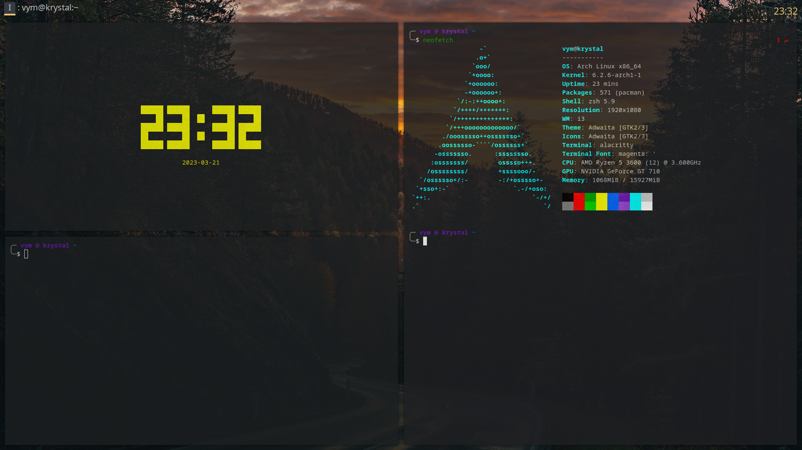
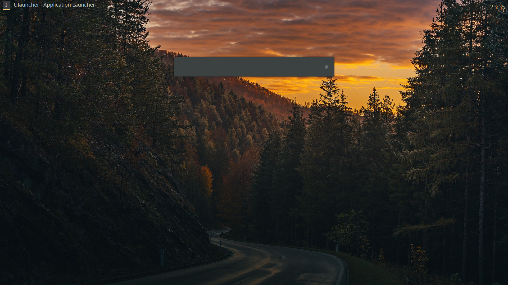

# My dotfiles

## What do I contain

This repo contains the config file of :

- Picom
- Dunst
- I3
- Autostart
- Alacritty
- Zsh
- Oh-my-zsh
- Vim
- Nvim 
- Lightdm
- Lightdm-webkit2-greeter
- Polybar
- Udev rules

I also add some little things, like my background and my scripts.

## How to Install
